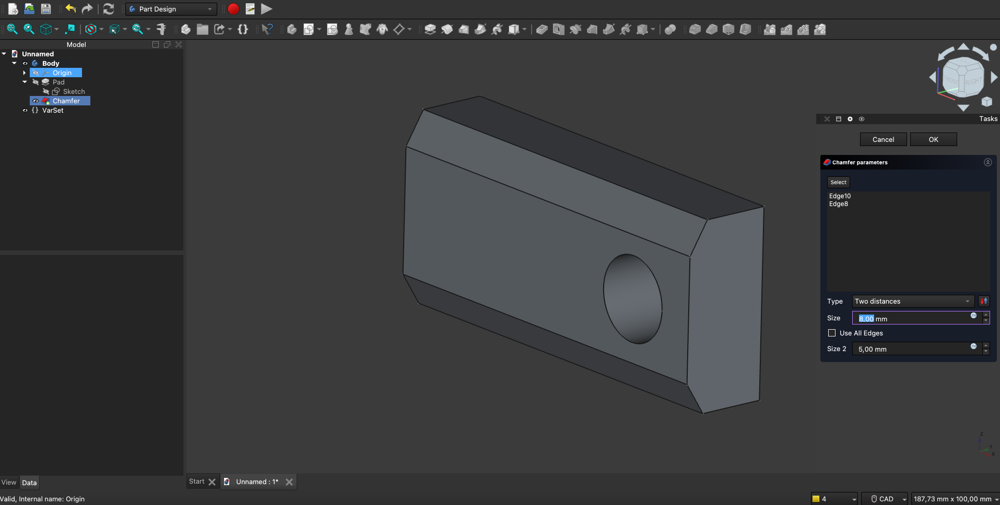
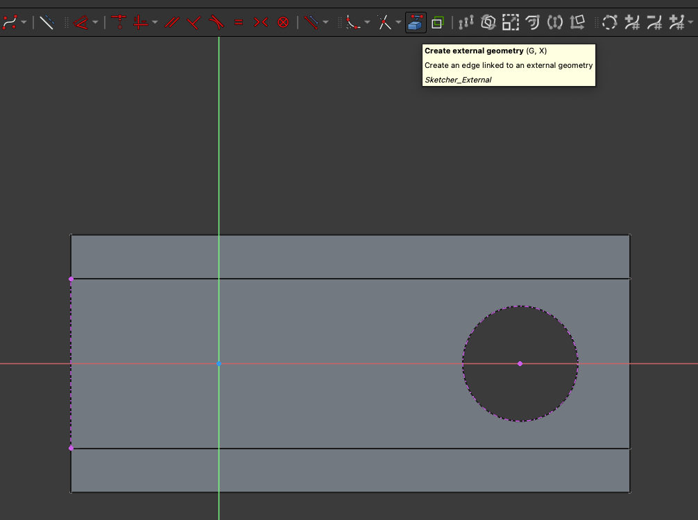
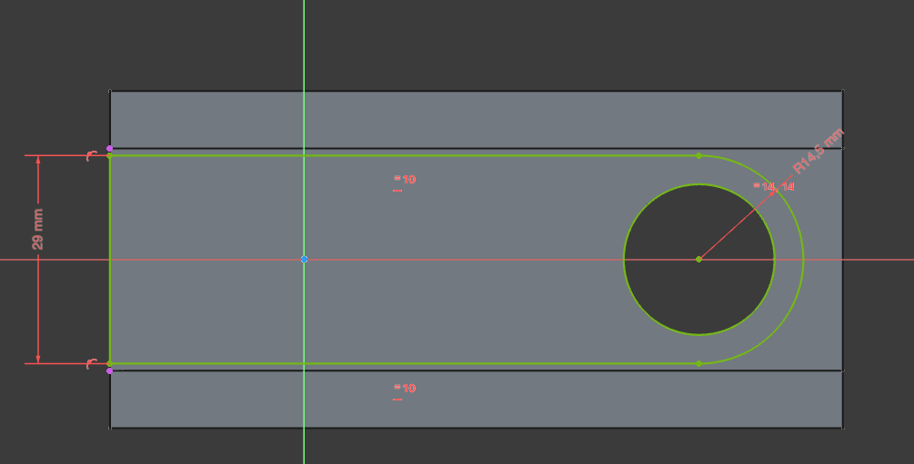
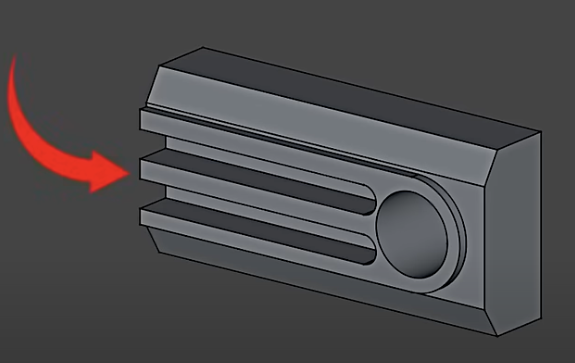
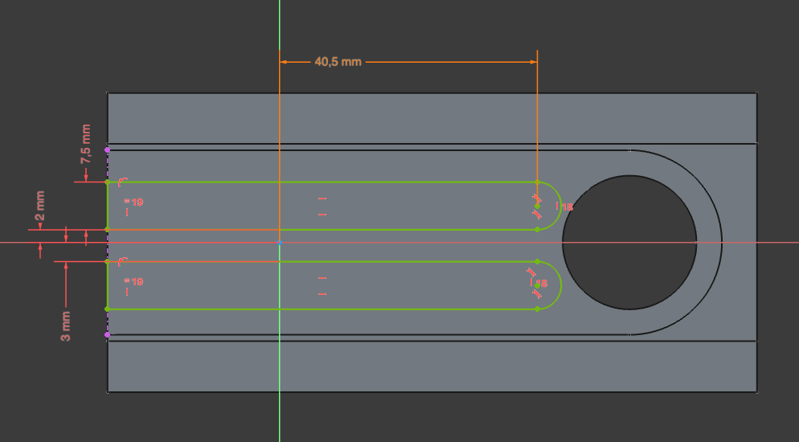
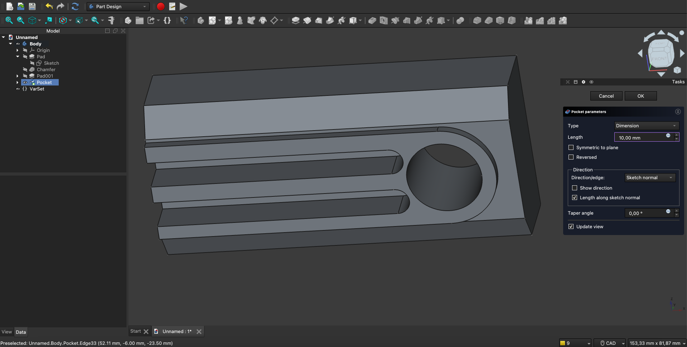
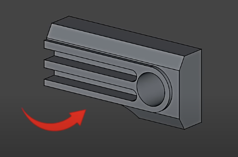

# FreeCAD: A Guide

This folder/document contains guides on [FreeCAD](https://www.freecad.org) parametric modeler, version 1.0.

## Table of Contents

- [FreeCAD: A Guide](#freecad-a-guide)
  - [Table of Contents](#table-of-contents)
  - [Beginner Guide](#beginner-guide)
    - [Part 0: Introduction - Workbenches, Coordinate System, Navigation, Selection, Create Body](#part-0-introduction---workbenches-coordinate-system-navigation-selection-create-body)
    - [Part 1: Build Base Part - Sketch, Variables, Padding, Chamfer](#part-1-build-base-part---sketch-variables-padding-chamfer)
    - [Part 2: Sketch and Pad on Face](#part-2-sketch-and-pad-on-face)
    - [Part 3: Openings - Sketch and Pocket on Face](#part-3-openings---sketch-and-pocket-on-face)
    - [Part 4: Through-Part Pocket on Face](#part-4-through-part-pocket-on-face)
    - [Part 6: Symmetry](#part-6-symmetry)
  - [Guía para Principiantes](#guía-para-principiantes)

## Beginner Guide

Sources: 

- [Deltahedra: FreeCAD 1.0 Release - Ultimate Complete Beginner Tutorial](https://www.youtube.com/watch?v=E14m5hf6Pvo)
- [Deltahedra: FreeCAD 1.0 x Blender : Render and Animate your 3D CAD files - Complete Beginner Tutorial](https://www.youtube.com/watch?v=6amHcXHxCa8)
- [FreeCAD: Getting Started](https://wiki.freecad.org/Getting_started)

### Part 0: Introduction - Workbenches, Coordinate System, Navigation, Selection, Create Body

FreeCAD has several workbenches on the Welcome page: each consists of a toolset for parametric modeling:

- Parametric part
- Assembly
- 2D draft
- BIM/Architecture
- Empty file
- Open

The workbenches often interact with each other and we can select different ones when we are editing.

We can select **Empty file**, and a new empty edit view/window opens.

We see different menus/elements:

- Change navigation/view mode (bottom right): Blender, CAD, etc.
- Select other workbenches (up left): Part design, Assembly, etc.
  - We select **Part design**.
- Tasks, with **Create body**.
  - Pick and drag the **Tasks** panel to the right for better visibility.
- Menu with tools.
- Navigation cube (up right).

We click on Tasks > **Create body**. A **Model tree** is created with

- Body
- Coordinate system (visualize with eye icon or space bar key)

Navigation and selection in CAD mode:

- Scroll wheel: zoom
- Shift + right click: rotate around clicked point.
- Alt/Cmd + right click: translate
- Middle button click: translate
- One left click on element: select
  - Second click: select complete object
  - Third click: select container
- Left click holding Alt/Cmd: multiple item selection
- If a tool is selected
  - Left click: use on item
  - Right click: dis-select tool

To start creating a 3D part, we need to create a 2D sketch; to that end, we need to know the primitive shapes and view sketches of the part and think of a workflow:

- First, we need to know the part shapes, etc.; *las vistas del objeto*.
- Then, we think of how to build it step by step:
  - A prism first, maybe
  - Holes in it
  - Chamfers
  - etc.

Example built in the tutorial:

- Rectangular prism
- Symmetrical

### Part 1: Build Base Part - Sketch, Variables, Padding, Chamfer

Steps to follow:

- Initiate new sketch: **Create new sketch** icon on menu.
- Select sketching plane: XZ
- Usually, we build a shape with the menu tools and then constrain it (dimension, relationships, alignment, etc.).
  - We can create a circle, rectangle, polyline, etc.
  - We can assign radius, center location, length, etc.
  - We have drawing tools and constrain tools (e.g., make it horizontal).
  - We need to constrain all lines.
- To select several drawing pieces: left click + Ctrl.
  - Context menu with constraints appears: equal, parallel, symmetry, etc.
- We can also select drawing pieces (e.g., lines), and click on constrain tools, e.g.: Dimension.
- Constrain tools need often several pieces to be selected.
- When a part/sketch side is fully constrained, it turns green.
  - Click **Close** on the **Tasks** panel when finished.

We can leave the sketch as it is, but now we define a **Variable** in the part tree using the `{}` icon.
Variables can be used in the sketches, so that:

- Several entities/pieces are dependent on them
- If we change the variable outside, the sketch changes

So, in other words, they introduce a parametric approach to modeling.

Steps to follow:

- Click on **Create a variable set**
- Name: Size; Ok
- New item **VarSet** appears in the tree; we can modify its Size: 55mm.

Now we can use it in the Sketch:

- Double click on Sketch (in the tree).
- Double click on distance from circle center to axis
- Click on `f(x)`, enter `VarSet.Size`.
- Now, distance turns orange, not green: it means it is controlled by a variable.
- We repeat the process for the distance between axis and end stem of the part
  - We introduce after clicking on `f(x)`: `VarSet.Size+20mm` (don't forget units).
  - This way, we ensure that the distance from the circle end to the stem end is the same!
- Close/exit sketch.
- If we change the Variable Size value, the sketch changes!

Now, we apply **padding**: we give a thickness to the sketch, i.e., it is an **extrusion**:

- Select sketch in tree.
- Tasks panel (modeling tools): **Pad**
- Select: Symmetric to plane
- Length: 22m; since it's symmetric, it will be 22x2.
- Ok
- Now, the object/item Pad appears in the tree and it contains the Sketch.

Finally, we apply 2 **chamfers** to the 3D part:

- Select both edges with holding Cmd/Alt.
- Select **Chamfer** tool.
- Two distances
  - 8mm, 5mm
- A new item/element appears in the tree

### Part 2: Sketch and Pad on Face

Once we have our parametrized base part, we will create a sketch on one of its faces and pad it.

It is important to know we can sketch not only on planes, but also on part faces.
Specifically for faces, it is important to project part edges we are going to use as reference to the sketching plane (i.e., the face we sketch on).

Steps to follow to **project edges on sketch plane**:

- Chose face
- Tasks panel / Face tools: Create sketch
- Project object contours to use them as constraints in our sketch
  - Select **Create external geometry** tool on menu
  - Select left edge and circle: project their contours to sketch

Then, we start drawing our sketch by using these new projected edge constraints:

- Create an arc constrained to the circle; if circle changes, arc changes.
  - R: 29/2 mm
- Draw lines from arc endpoints to left edge constrain: they must be horizontal
- Draw circle
- Constrain all elements by size, distances, geometrical relationships.
  - For the circle: Equal constrain wrt. projected circle contour.
  - To do it, make circle smaller, them use equal constraint and it snaps to constraint.
- Ok/Close
- Pad (Task menu): 2,5mm
- Check that if we modify `VarSet.Size`, everything changes properly.

### Part 3: Openings - Sketch and Pocket on Face

In this part, we will create some openings.

To that end, the **Pocket** operation is used, which is the negative of the **Pad**/extrusion operation.

The same face as before is used as sketching plane, also projecting some edges as constraints and using the `VarSet.Size` as parametric value.

Used tools/operations:

- Create external geometry
- Create arc by center
- Rectangle drawing
- Tangency constraint
- Dimension tool
- Vertical constraint
- Equality constraint
- Constraint coincident

Note: when we apply constraints, first we need to select (left click + Cmd/Alt) all elements.

Sketch:

After the sketch is done, we apply the **Pocket** operation: 10mm.

We can check that varying the `VarSet.Size` makes the correct changes in the part.

### Part 4: Through-Part Pocket on Face

This part is very similar to the previous, but the **pocket** created goes through the entire object.

We select the required face and create a sketch on it.

### Part 6: Symmetry

To mirror an object wrt. a plane:

- Select Body
- Tool: Mirrored
- Transform body
- Select plane: XY, XZ, or a face plane
- Ok

## Guía para Principiantes

Source: [FreeCAD para principiantes](https://www.youtube.com/watch?v=i2sQOnKn82o&list=PLSoJI9XzEIQyU80RC4QSMhupB1A-OgiCG&index=1)

TBD.

:construction:
