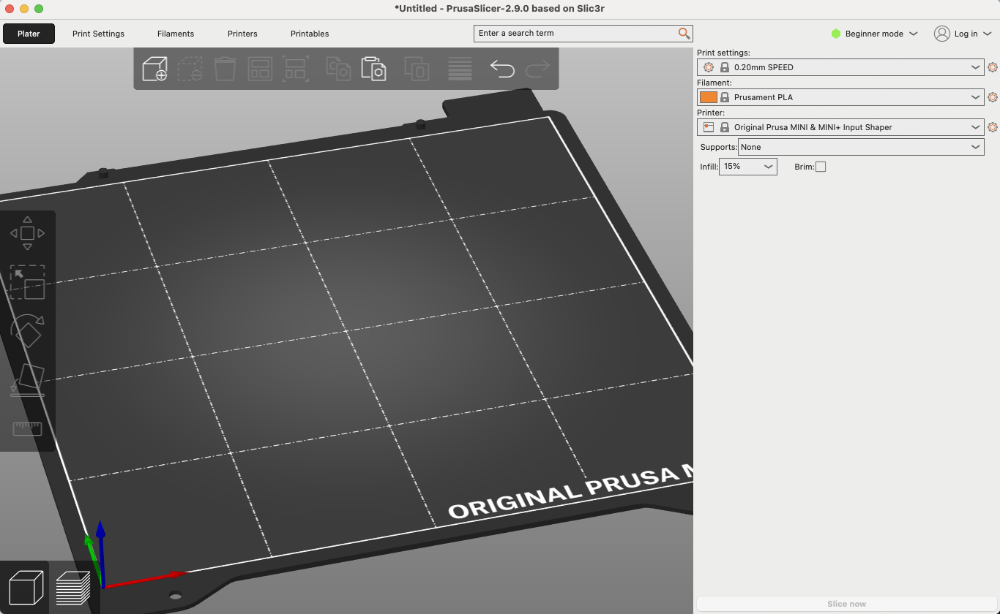

# PrusaMINI+: A Guide

## Table of Contents

- [PrusaMINI+: A Guide](#prusamini-a-guide)
  - [Table of Contents](#table-of-contents)
  - [Printer Guide](#printer-guide)
    - [Helpful 3D Printer Tools](#helpful-3d-printer-tools)
  - [Slicer Guide](#slicer-guide)
    - [Beginner Guide](#beginner-guide)
      - [Platter Tab: Tools (icons)](#platter-tab-tools-icons)
      - [Printer Settings Tab](#printer-settings-tab)

## Printer Guide

Initial setup links:

- [MANUAL: 3D Printing Handbook](https://cdn.prusa3d.com/downloads/manual/prusa3d_manual_mini_en.pdf)
- [Start here: Software, firmware, material and articles (Prusa MINI+)](https://help.prusa3d.com/tag/mini-2)

[Firmware updating (MINI/MINI+): Old Firmware Versions](https://help.prusa3d.com/article/firmware-updating-mini-mini_124784)

[Original Prusa MINI - Calibration and First Print](https://www.youtube.com/watch?v=6Nip9EnSz7Q)

[Prusa3D Forum: The first layer taken off while printing  ](https://forum.prusa3d.com/forum/general-discussion-announcements-and-releases/the-first-layer-taken-off-while-printing/)

[Prusa3D Forum: Life adjust Z - my way](https://forum.prusa3d.com/forum/original-prusa-i3-mk3s-mk3-assembly-and-first-prints-troubleshooting/life-adjust-z-my-way/)

[r/prusa: How to prevent print from detaching mid-print](https://www.reddit.com/r/prusa/comments/10qvpaw/how_to_prevent_print_from_detaching_midprint/)

[Prusa3D: First layer issues](https://help.prusa3d.com/article/first-layer-issues_1804)

[Prusament: Filaments](https://prusament.com/materials/)

TBD

:construction:

### Helpful 3D Printer Tools

- Bar glue
- Wet towels
- Magnifying glass

## Slicer Guide

### Beginner Guide

Source: [PrusaSlicer Beginner Tutorial: Learn the basics](https://www.youtube.com/watch?v=_kIqMPNQNSw)

The first time we open the Prusa Slicer, the **installation wizard** is launched:

- Installation wizard: select printer, config, etc.
- Also other printers than Prusa supported!

Then, the home screen appears:

In the upper right corner we can choose 3 modes:

- Beginner
- Normal: beginner settings + new ones
- Advanced: normal settings + new ones

The home screen has 4 tabs (and their tools vary depending on beginner/normal/... mode):

- Platter: 3D editor
- Printer: Choose a printer system preset
  - Layers and perimeter
  - Infill
  - Skirt and brim
  - Support material
- Filaments: Choose filament type and characteristics
  - PLA, etc.
  - Vendor: Prusament, generic, etc.
  - Diameter, density, cost, etc.
  - Cooling
  - Overrides
- Printers: we should have our printer selected; here we configure its parameters
  - Extruder:
    - Nozzle diameter: 0.4 mm
    - Travel lift height
    - Retraction length
- Printables: online store with free models

In the following, some notes on the tabs.

#### Platter Tab: Tools (icons)

- In **Beginner Mode** (mode can be chosen in upper right corner, beside the login)
  - 3D view editor / Preview
    - In preview we can see the slices
  - Add model, remove
    - We can add several models
    - Formats: STL, 3MF, STEP, OBJ, AMF, SVG
      - Not GCODE!
  - Arrange: make models disjoint
  - Copy and Paste
  - Move
  - Scale
  - Rotate
  - Place on face
  - Measure
  - Variable layer height: we can add detail (thinner slices) depending on height
- In **Normal Mode**:
  - Cut: if the height of our model is too much, we can piece it into two objects!
  - ...

#### Printer Settings Tab

